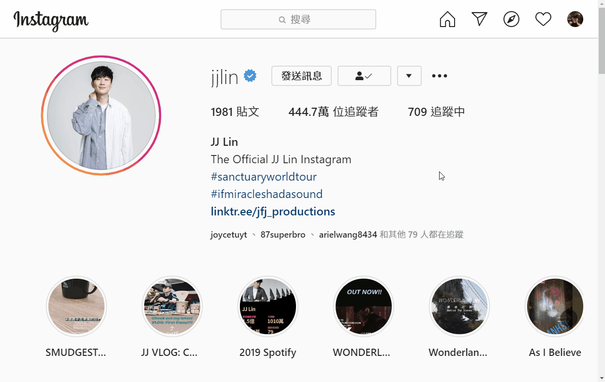

# IG_crawler

Download all the photos and videos on the instagram

## 操作方式：
```python
url_base = 'https://www.instagram.com/'
uri_account = 'https://www.instagram.com/graphql/query/?query_hash=a5164aed103f24b03e7b7747a2d94e3c&variables=%7B%22id%22%3A%22{user_id}%22%2C%22first%22%3A12%2C%22after%22%3A%22{cursor}%22%7D'
uri_hashtag = 'https://www.instagram.com/graphql/query/?query_hash=c769cb6c71b24c8a86590b22402fda50&variables=%7B%22tag_name%22%3A%22{user_id}%22%2C%22first%22%3A12%2C%22after%22%3A%22{cursor}%22%7D'
# 請更改cookie_data內的訊息，以成功獲取已追蹤非公開帳號的權限
cookie_data = '在這邊貼上自己的cookie'
headers = {
    'user-agent': 'Mozilla/5.0 (Windows NT 10.0; Win64; x64) AppleWebKit/537.36 (KHTML, like Gecko) Chrome/68.0.3440.106 Safari/537.36',
    # 透過cookie取得權限
    'cookie': cookie_data
}
```



於instagram網站登入後，進入開發者人員工具介面，將cookie複製貼上於程式碼中

- 此程式在執行時會存取使用者於instagram網頁的cookie

- 執行後輸入目標帳號(ex. jjlin)或hashtag(ex. #taiwan)

- 註:hashtag搜尋之影片只會以照片形式下載